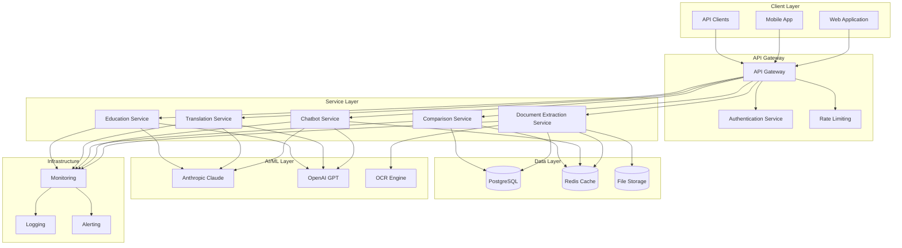
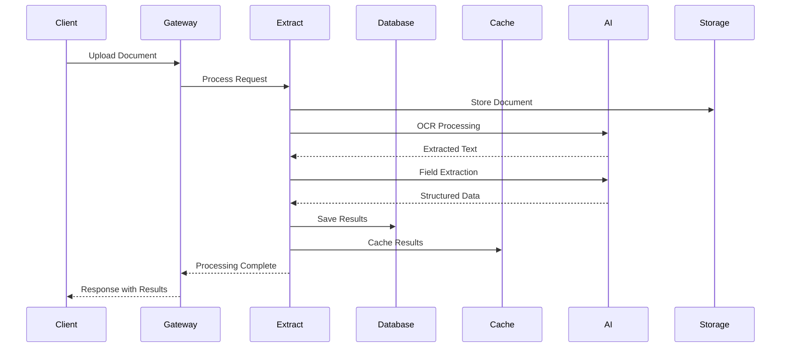

# System Design Architecture

## Overview

The Student Loan Intelligence System is designed with a microservices architecture following KIRO Global Steering Guidelines. The system emphasizes modularity, scalability, and maintainability.

## High-Level Architecture

## Core Components

### 1. API Gateway
- **Purpose**: Single entry point for all client requests
- **Features**: Authentication, rate limiting, load balancing
- **Technology**: FastAPI with nginx reverse proxy

### 2. Service Layer
- **Document Extraction Service**: Handles OCR and AI-powered field extraction
- **Chatbot Service**: RAG-powered Q&A and financial education
- **Comparison Service**: Loan offer analysis and comparison
- **Translation Service**: Multi-language document processing
- **Education Service**: Financial guidance and recommendations

### 3. Data Layer
- **PostgreSQL**: Primary database for structured data
- **Redis**: Caching and session management
- **File Storage**: Document and media storage (S3/MinIO)

### 4. AI/ML Layer
- **Anthropic Claude**: Advanced reasoning and analysis
- **OpenAI GPT**: Text generation and understanding
- **OCR Engines**: Tesseract and EasyOCR integration

## Data Flow Architecture

## Security Architecture

### Authentication & Authorization
- **JWT Tokens**: Stateless authentication
- **Role-Based Access Control (RBAC)**: Permission management
- **API Key Management**: Secure service-to-service communication

### Data Protection
- **Encryption at Rest**: AES-256 for stored data
- **Encryption in Transit**: TLS 1.3 for all network communications
- **PII Masking**: Sensitive data protection

### Infrastructure Security
- **Container Security**: Docker security scanning
- **Network Security**: VPC and firewall configurations
- **Secret Management**: HashiCorp Vault or AWS Secrets Manager

## Scalability Strategy

### Horizontal Scaling
- **Stateless Services**: Easy horizontal scaling
- **Load Balancing**: Application load balancer
- **Auto-Scaling**: Based on CPU, memory, and request metrics

### Database Scaling
- **Read Replicas**: Horizontal read scaling
- **Connection Pooling**: Efficient database connections
- **Caching Strategy**: Multi-layer caching (Redis + application cache)

### Performance Optimization
- **Async Processing**: Non-blocking I/O operations
- **Batch Processing**: Efficient bulk operations
- **CDN Integration**: Static content delivery

## Monitoring & Observability

### Monitoring Stack
- **Prometheus**: Metrics collection
- **Grafana**: Visualization and dashboards
- **AlertManager**: Alert management

### Logging Strategy
- **Structured Logging**: JSON format for easy parsing
- **Centralized Logging**: ELK stack or CloudWatch
- **Log Levels**: DEBUG, INFO, WARNING, ERROR, CRITICAL

### Health Checks
- **Service Health**: Application health monitoring
- **Database Health**: Connection and performance metrics
- **External Service Health**: API integration monitoring

## Disaster Recovery

### Backup Strategy
- **Database Backups**: Automated daily backups
- **Point-in-time Recovery**: 1-hour recovery point objective (RPO)
- **Cross-region Replication**: Geo-redundant backups

### High Availability
- **Multi-AZ Deployment**: AWS availability zones
- **Failover Mechanism**: Automatic service failover
- **Graceful Degradation**: Reduced functionality during outages

## Technology Choices Rationale

### Backend Technologies
- **FastAPI**: Modern, high-performance API framework
- **Python 3.11+**: Latest language features and performance
- **SQLAlchemy 2.0**: Modern async ORM with type safety

### AI/ML Technologies
- **Anthropic Claude**: Superior reasoning capabilities
- **OpenAI GPT**: Versatile text generation
- **LangChain**: AI orchestration framework

### Infrastructure Technologies
- **Docker**: Containerization for consistency
- **AWS**: Cloud backend with managed services
- **PostgreSQL**: Reliable relational database

## Development & Deployment

### Code Architecture
- **Domain-Driven Design (DDD)**: Business logic organization
- **Clean Architecture**: Layer separation and dependency inversion
- **Hexagonal Architecture**: Port and adapter pattern

### CI/CD Pipeline
- **GitHub Actions**: Automated testing and deployment
- **Docker Registry**: Container image management
- **Infrastructure as Code**: Terraform for cloud resources

### Testing Strategy
- **Unit Tests**: 90% code coverage requirement
- **Integration Tests**: API and database integration
- **End-to-End Tests**: Complete workflow testing

## Future Scalability

### Planned Enhancements
- **Microservices**: Service decomposition for better maintainability
- **Event-Driven Architecture**: Message queues for async processing
- **GraphQL API**: More flexible client queries
- **Real-time Features**: WebSocket-based updates

### Technology Roadmap
- **Kubernetes**: Container orchestration
- **Service Mesh**: Istio for service communication
- **Machine Learning Ops**: MLOps pipeline optimization
- **Advanced AI**: Custom model training and fine-tuning
